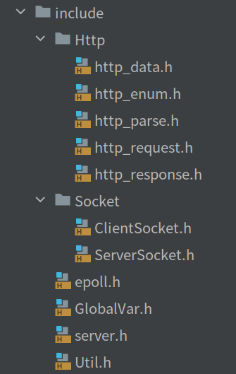

# webserver 第一版
##项目文件结构
* figures/:README的图片
* include/ ： 头文件
* pages/ : html文件
* src/ : 主要代码
* cmake-build-debug/ ： cmake文件，基于Clion IDE开发，编译应当在此
* main.cpp : 主函数入口
* CMakeLists.txt : CMake文件，修改应当在此
##项目源码结构

1. `Socket`
   * `ServerSocket.h` : 服务端的socket信息：监听socket,epoll_fd,服务器端口和ip。对socket的函数做封装
   * `ClientSocket.h` : 客户端的socket的信息，只包含当前client对象所用socket的fd
2. `http`:
   * `http_request` :http请求报文信息，包括 <方法、url、版本 、头部字段>
   * `http_response` : http响应报文，包括 <版本、状态码等信息>
   * `Http_data.h` : 包含一个`http_request`和一个`http_response`和一个`ClientSocket`对象
   * `http_parse.h` : 一个方法类，用于http_data的解析
   * `http_enum.h` ：一堆http状态码的定义
3. `Epoll.h`： 对epoll函数中做封装
4. `Server.h` ： 主要文件，程序入口所在
5. `Util.h` : 一些简单函数

## 编译
```shell
//编译,进入cmake-build-debug目录下
cd cmake-build-debug
cmake .
make

//运行，在cmake-build-debug目录下运行可执行文件，如果希望更改运行目录，请修改GlobalVar.h中的basePath为程序运行目录相对pages/目录的位置
./webserver_new
```